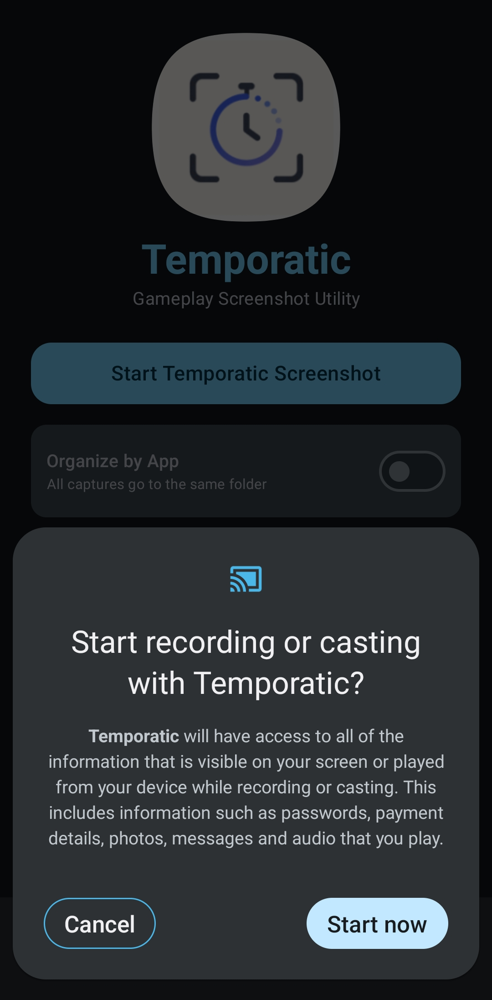
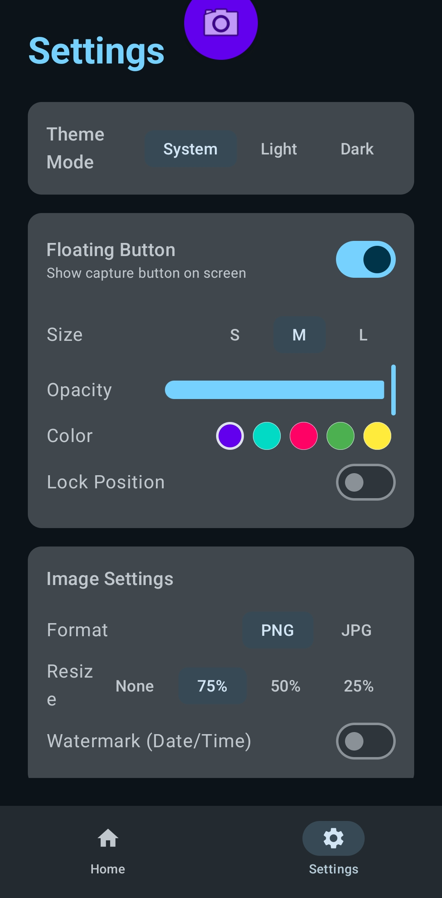
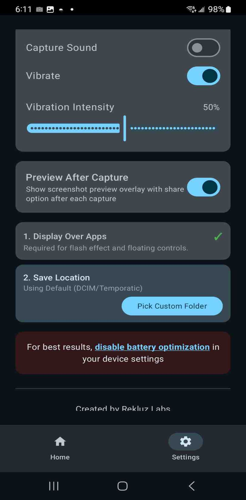

# Temporatic

  

# Temporatic

A floating screenshot utility for Android testers.

Launch Temporatic once, grant the overlay and screen capture permissions, then switch to whatever app you're testing. A small button sits over the corner of the screen while you work. Tap it whenever you want a screenshot captured. The image is saved to your device and can be shared or emailed without leaving the app you're in.

Temporatic provides tag, crop, and share options for any screenshot.

Temporatic also includes a timestamp feature that can be toggled in settings. When enabled, it generates a Temporatic Proof containing the date and time of capture along with the device used.

Built for developers who need to capture real testing sessions without breaking their workflow to handle a screenshot manually each time.

## Built for closed testing and test-for-test exchanges

Google Play's closed testing requirements ask developers to recruit a minimum number of testers who install and use the app for a set period before it can move toward production. Many solo and small-team Android developers meet that requirement through test-for-test arrangements on r/androiddev, r/AndroidTestersHub, and similar subreddits, where two developers install and use each other's apps as testers.

These exchanges usually run on trust, and screenshots are the common way testers prove they installed the app and actually opened it. Temporatic's timestamp feature covers this directly: toggle it on, capture a screenshot inside the app being tested, and the image embeds the date, time, and device model in the frame itself. The other developer gets proof of a specific session on a specific device without either side needing a separate verification step.

The floating capture button matters here too. A tester moving between their own testing checklist and the app under test doesn't need to back out to a screenshot tool, take the shot, then switch back. The button stays on screen through the whole session, so a round of test-for-test screenshots takes as many taps as there are screens to capture.

  
  
  

## Requirements

- Android 8.0 (Oreo) or higher
- "Draw over other apps" permission
- Screen capture permission (prompted on first use)

## How it works

1. Open Temporatic and tap Start.
2. Switch to the app you want to test.
3. Tap the floating button whenever you want a screenshot.
4. The image is saved and queued for sharing.

No accounts. No analytics. No background data collection.
## License

Copyright © 2026 Rekluz Labs. All Rights Reserved.

This project is source-available for personal, educational, and non-commercial 
viewing only. Redistribution, commercial use, or publishing modified/forked 
copies is not permitted without written permission. See [LICENSE](LICENSE) 
for full terms.
