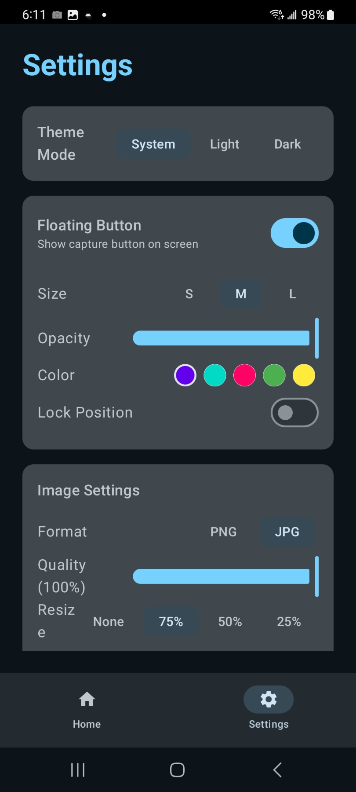
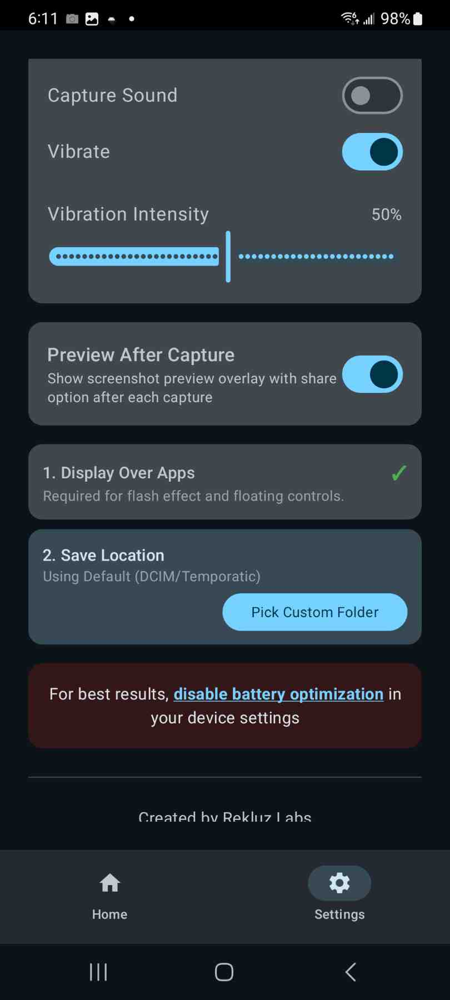

# Temporatic

A floating screenshot utility for Android testers. Launch Temporatic once, grant the overlay and screen capture permissions, then switch to whatever app you're testing. A small button sits over the corner of the screen while you work. Tap it whenever you want a screenshot captured. The image is saved to your device and can be shared or emailed without leaving the app you're in.

Temporatic provides tag, crop, and share options for any screenshot.

Temporatic also includes a timestamp feature that can be toggled in settings. When enabled, it generates a Temporatic Proof containing the date and time of capture along with the device used.

Built for developers who need to capture real testing sessions without breaking their workflow to handle a screenshot manually each time.

This app is currently working but should be considered an Alpha build.

## Requirements

- Android 8.0 (Oreo) or higher
- "Draw over other apps" permission
- Screen capture permission (prompted on first use)

## How it works

1. Open Temporatic and tap Start.
2. Switch to the app you want to test.
3. Tap the floating button whenever you want a screenshot.
4. The image is saved and queued for sharing.

No accounts. No analytics. No background data collection.
